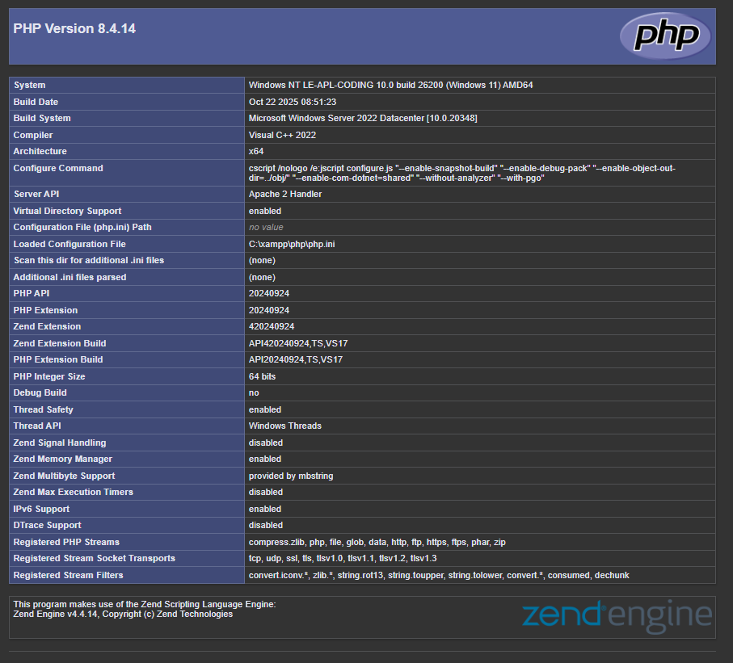
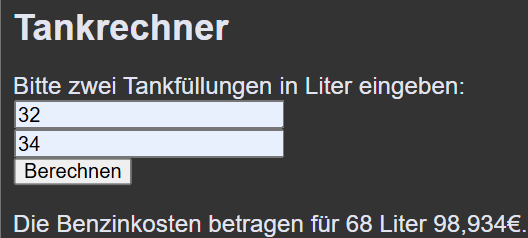
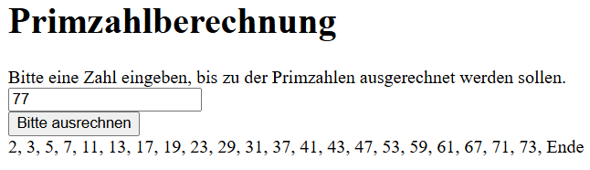
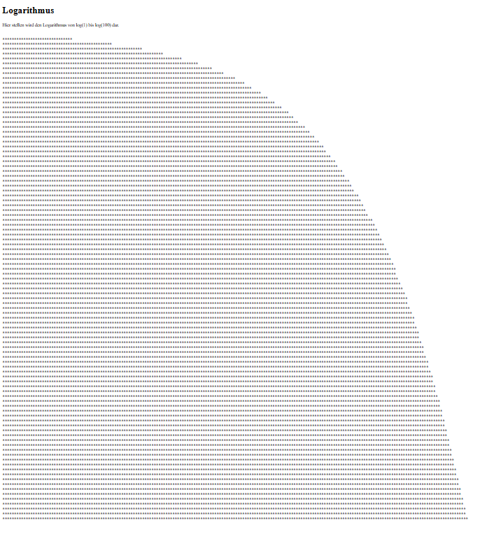
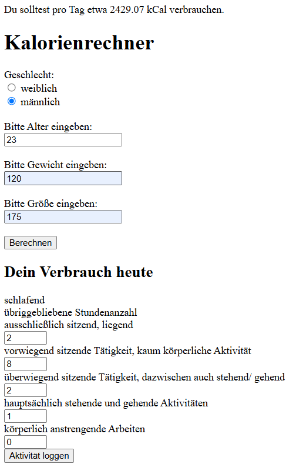

# Berufsschule_3

Autor: Anna Forstner  
LBS Eibiswald | 3a APC

Hier kommen die Dateien für die Berufsschule rein...

## Verwendung
Technologien im Einsatz:  
PHP

## Screenshots zur Installation von xampp

## Screenshots zur Übung 2: Form und Rechner

## Screenshot zur Übung 3: Prim und Log
Alle Primzahlen bis 77:

Logarithmus von 1 bis 100, dargestellt mit Zeichen:

## Screenshot zur Übung 4: Kalorienrechner
Diese Übung ist unvollständig!

